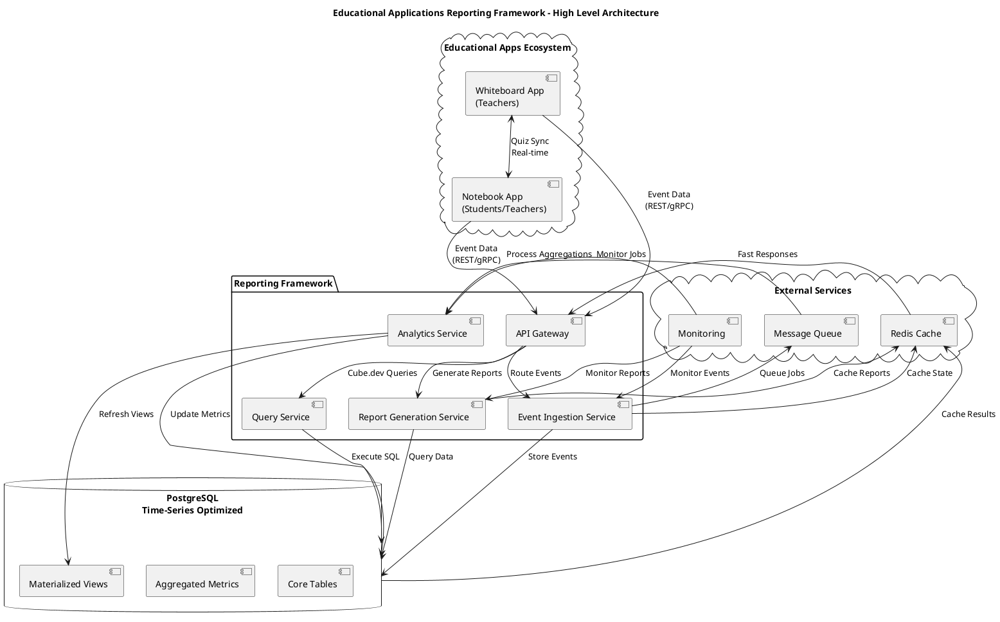
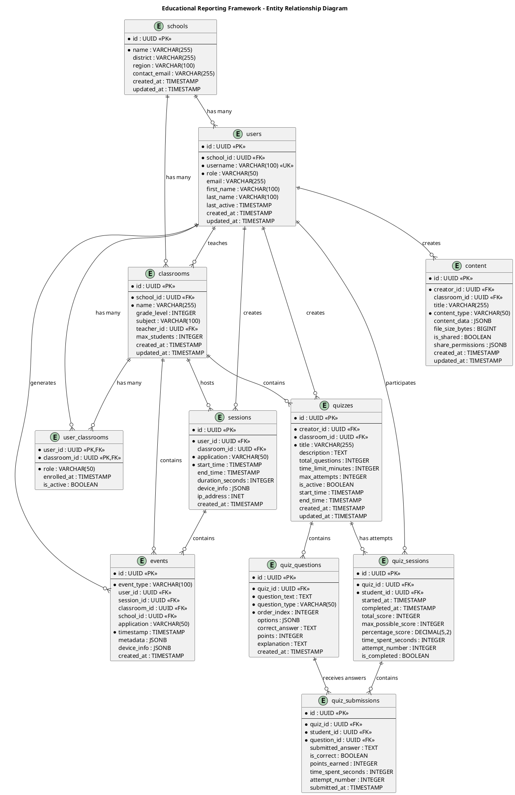
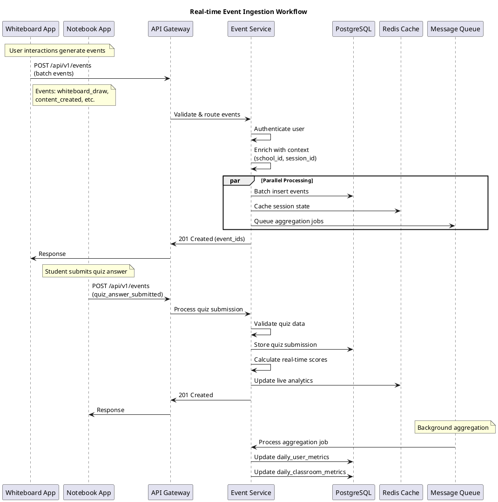
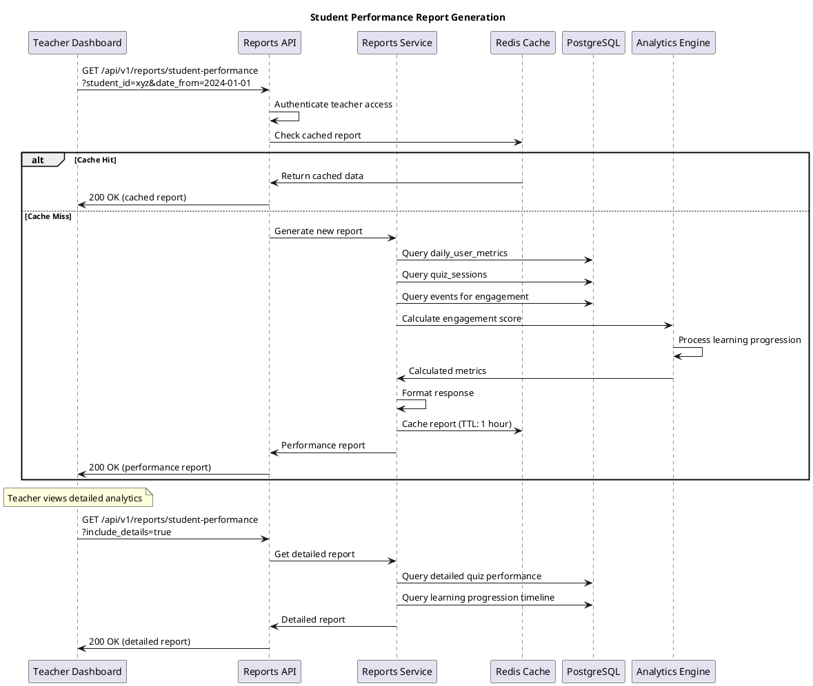
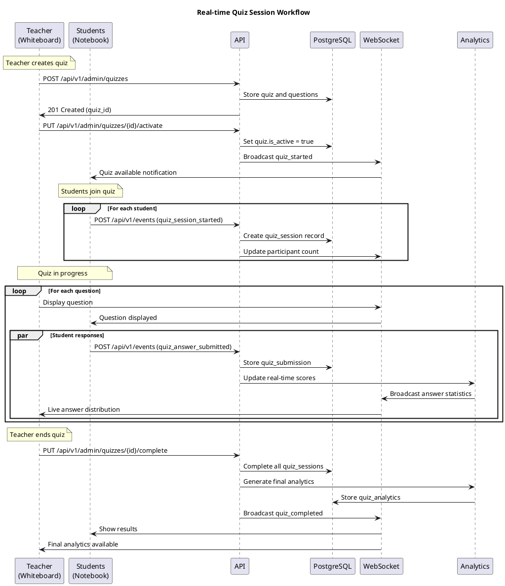
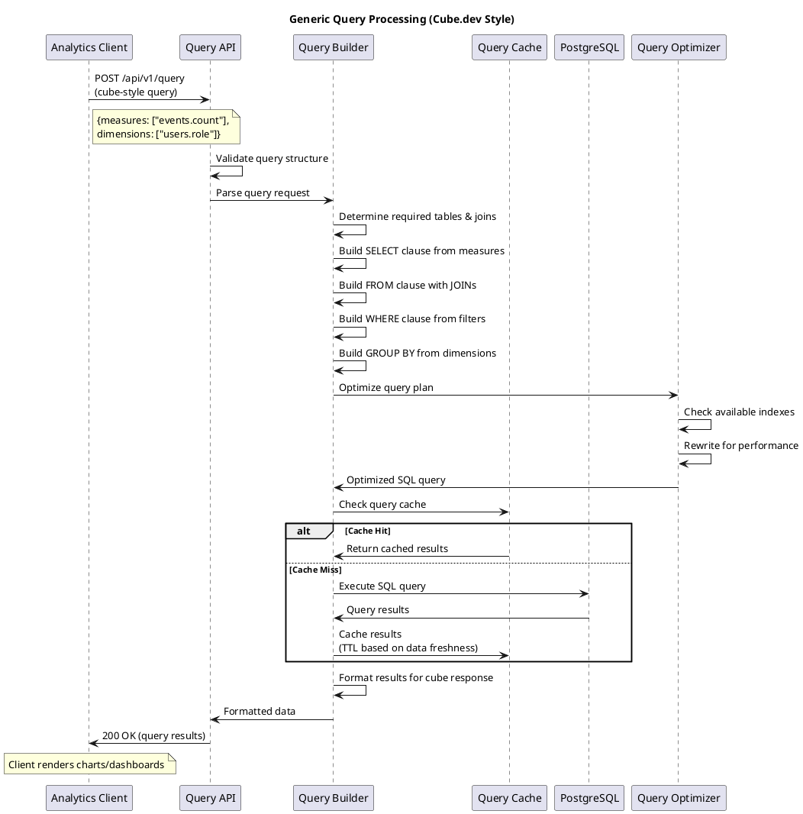

# Educational Applications Reporting Framework

## 🎯 Project Overview

A comprehensive reporting framework designed for educational applications ecosystem consisting of **Whiteboard App** (digital classroom whiteboard for teachers) and **Notebook App** (personal note-taking for students/teachers). The framework captures, stores, and analyzes user interactions with a particular focus on the synchronized **Quiz feature**.

### 📊 Scale Requirements
- **1,000 schools**
- **30 classrooms per school** (30,000 total)
- **30 students per classroom** (900,000 total users)

---

## 🏗️ System Architecture

### High-Level Architecture Diagram



### Component Architecture Diagram

```plantuml
@startuml Component_Architecture
!define RECTANGLE class

title Educational Reporting Framework - Component Architecture

package "Client Applications" {
  component [Whiteboard App] as WB
  component [Notebook App] as NB
}

package "API Layer" {
  component [Event Ingestion API] as EIA
  component [Reports API] as RA
  component [Analytics API] as AA
  component [Generic Query API] as GQA
  component [Admin API] as ADA
}

package "Service Layer" {
  component [Event Processing Service] as EPS
  component [Aggregation Service] as AGS
  component [Report Generation Service] as RGS
  component [Query Builder Service] as QBS
}

package "Data Layer" {
  database [PostgreSQL] as PG {
    [Events Table]
    [Users Table]
    [Schools Table]
    [Classrooms Table]
    [Quiz Data Tables]
    [Aggregated Metrics]
    [Materialized Views]
  }

  database [Redis Cache] as RC {
    [Session Cache]
    [Report Cache]
    [Query Cache]
  }
}

package "Background Jobs" {
  component [Metrics Aggregator] as MA
  component [Report Scheduler] as RS
  component [Data Cleanup] as DC
}

WB --> EIA : POST /events
NB --> EIA : POST /events
WB --> RA : GET /reports
NB --> RA : GET /reports

EIA --> EPS : Process Events
RA --> RGS : Generate Reports
AA --> AGS : Real-time Analytics
GQA --> QBS : Build Queries
ADA --> EPS : Admin Operations

EPS --> PG : Store Events
EPS --> RC : Cache State
RGS --> PG : Query Data
RGS --> RC : Cache Reports
QBS --> PG : Execute Queries
AGS --> PG : Read Metrics

MA --> PG : Update Aggregations
RS --> RGS : Schedule Reports
DC --> PG : Cleanup Old Data

@enduml
```

---

## 🗄️ Database Schema Design

### Entity Relationship Diagram



### Aggregated Metrics Schema

```plantuml
@startuml Aggregated_Metrics_Schema
!define TABLE entity

title Aggregated Metrics and Performance Tables

entity "daily_user_metrics" as dum {
  * id : UUID <<PK>>
  --
  * user_id : UUID <<FK>>
  * school_id : UUID <<FK>>
  * date : DATE <<UK>>
  session_count : INTEGER
  total_session_duration_seconds : INTEGER
  avg_session_duration_seconds : DECIMAL(10,2)
  events_count : INTEGER
  quiz_attempts : INTEGER
  quiz_completions : INTEGER
  avg_quiz_score : DECIMAL(5,2)
  content_created_count : INTEGER
  content_viewed_count : INTEGER
  whiteboard_events : INTEGER
  notebook_events : INTEGER
  collaboration_events : INTEGER
  created_at : TIMESTAMP
  updated_at : TIMESTAMP
}

entity "daily_classroom_metrics" as dcm {
  * id : UUID <<PK>>
  --
  * classroom_id : UUID <<FK>>
  * school_id : UUID <<FK>>
  * date : DATE <<UK>>
  total_students : INTEGER
  active_students_count : INTEGER
  participation_rate : DECIMAL(5,2)
  total_sessions : INTEGER
  avg_session_duration_minutes : DECIMAL(10,2)
  total_quiz_sessions : INTEGER
  avg_quiz_completion_rate : DECIMAL(5,2)
  avg_class_quiz_score : DECIMAL(5,2)
  content_created_count : INTEGER
  content_shared_count : INTEGER
  whiteboard_usage_minutes : INTEGER
  notebook_usage_minutes : INTEGER
  sync_events_count : INTEGER
  engagement_score : DECIMAL(5,2)
  created_at : TIMESTAMP
  updated_at : TIMESTAMP
}

entity "weekly_school_metrics" as wsm {
  * id : UUID <<PK>>
  --
  * school_id : UUID <<FK>>
  * week_start_date : DATE <<UK>>
  total_classrooms : INTEGER
  active_classrooms : INTEGER
  total_users : INTEGER
  active_users : INTEGER
  total_students : INTEGER
  active_students : INTEGER
  total_teachers : INTEGER
  active_teachers : INTEGER
  total_sessions : INTEGER
  avg_daily_sessions : DECIMAL(10,2)
  total_quiz_sessions : INTEGER
  avg_school_engagement : DECIMAL(5,2)
  total_content_created : INTEGER
  platform_adoption_rate : DECIMAL(5,2)
  created_at : TIMESTAMP
  updated_at : TIMESTAMP
}

entity "content_metrics" as cm {
  * id : UUID <<PK>>
  --
  * content_id : UUID <<FK>> <<UK>>
  classroom_id : UUID <<FK>>
  school_id : UUID <<FK>>
  * content_type : VARCHAR(50)
  view_count : INTEGER
  unique_viewers : INTEGER
  avg_view_duration_seconds : DECIMAL(10,2)
  interaction_count : INTEGER
  share_count : INTEGER
  effectiveness_score : DECIMAL(5,2)
  last_viewed_at : TIMESTAMP
  created_at : TIMESTAMP
  updated_at : TIMESTAMP
}

entity "quiz_analytics" as qa {
  * id : UUID <<PK>>
  --
  * quiz_id : UUID <<FK>> <<UK>>
  * classroom_id : UUID <<FK>>
  total_attempts : INTEGER
  unique_participants : INTEGER
  completion_rate : DECIMAL(5,2)
  avg_score : DECIMAL(5,2)
  avg_time_spent_minutes : DECIMAL(10,2)
  difficulty_score : DECIMAL(5,2)
  question_analytics : JSONB
  last_attempt_at : TIMESTAMP
  created_at : TIMESTAMP
  updated_at : TIMESTAMP
}

entity "active_sessions" as as {
  * id : UUID <<PK>>
  --
  * session_id : UUID <<FK>> <<UK>>
  * user_id : UUID <<FK>>
  classroom_id : UUID <<FK>>
  * application : VARCHAR(50)
  last_heartbeat : TIMESTAMP
  current_activity : VARCHAR(100)
  activity_metadata : JSONB
  created_at : TIMESTAMP
}

entity "hourly_event_aggregates" as hea {
  * id : UUID <<PK>>
  --
  * hour_timestamp : TIMESTAMP <<UK>>
  school_id : UUID <<FK>>
  classroom_id : UUID <<FK>>
  * event_type : VARCHAR(100) <<UK>>
  application : VARCHAR(50) <<UK>>
  event_count : INTEGER
  unique_users : INTEGER
  created_at : TIMESTAMP
}

' Relationships to main tables
dum }o--|| users : "metrics for"
dcm }o--|| classrooms : "metrics for"
wsm }o--|| schools : "metrics for"
cm }o--|| content : "metrics for"
qa }o--|| quizzes : "analytics for"
as }o--|| sessions : "tracks"
hea }o--|| schools : "aggregates for"
hea }o--|| classrooms : "aggregates for"

@enduml
```



---

## 🔄 Sequence Diagrams

### Real-time Event Ingestion Workflow



### Student Performance Report Generation



### Quiz Session Workflow



### Cube.dev Style Query Processing



---

## 📊 API Design

### Event Ingestion Endpoints

```http
POST /api/v1/events
Content-Type: application/json
Authorization: Bearer <jwt_token>

{
  "events": [
    {
      "event_type": "quiz_answer_submitted",
      "timestamp": "2024-01-15T10:30:45Z",
      "metadata": {
        "quiz_id": "quiz_789",
        "question_id": "q_123",
        "answer": "option_b",
        "time_spent": 45
      }
    }
  ]
}
```

### Report Generation Endpoints

#### Student Performance Report
```http
GET /api/v1/reports/student-performance?student_id={uuid}&date_from={date}&date_to={date}&include_details={boolean}
```

#### Classroom Engagement Report
```http
GET /api/v1/reports/classroom-engagement?classroom_id={uuid}&date_from={date}&date_to={date}
```

#### Content Effectiveness Report
```http
GET /api/v1/reports/content-effectiveness?school_id={uuid}&content_type={string}&date_from={date}&date_to={date}
```

### Generic Query API (Cube.dev Style)

```http
POST /api/v1/query
Content-Type: application/json

{
  "measures": ["events.count", "users.avg_session_duration"],
  "dimensions": ["users.role", "events.event_type"],
  "timeDimensions": [
    {
      "dimension": "events.timestamp",
      "granularity": "day",
      "dateRange": ["2024-01-01", "2024-01-31"]
    }
  ],
  "filters": [
    {
      "member": "classrooms.school_id",
      "operator": "equals",
      "values": ["school_123"]
    }
  ]
}
```

---

## 🚀 Quick Start Guide

### Prerequisites
- Go 1.21+
- PostgreSQL 13+
- Redis (optional, for caching)

### Setup Instructions

1. **Clone and Setup**
```bash
git clone <repository>
cd jio-supperr
go mod download
```

2. **Database Setup**
```bash
# Create database
createdb reporting_db

# Set environment variables
export DB_HOST=localhost
export DB_PORT=5432
export DB_USER=postgres
export DB_PASSWORD=password
export DB_NAME=reporting_db
```

3. **Run Migrations and Seed Data**
```bash
# Run the demo (includes migrations and seeding)
go run cmd/demo/main.go
```

4. **Start the Server**
```bash
# Start the reporting server
go run cmd/reporting-server/main.go
```

5. **Access the API**
- Health Check: http://localhost:8080/health
- API Documentation: http://localhost:8080/docs
- Student Performance: http://localhost:8080/api/v1/reports/student-performance?student_id={uuid}

### Running the Demo

The demo script demonstrates all three required report types:

```bash
go run cmd/demo/main.go
```

This will:
- ✅ Create and populate the database with sample data (1,000 schools, 30,000 classrooms, 900,000 users)
- ✅ Generate **Student Performance Analysis** reports
- ✅ Generate **Classroom Engagement Metrics** reports
- ✅ Generate **Content Effectiveness Evaluation** reports
- ✅ Demonstrate **Cube.dev style generic queries**
- ✅ Save sample reports as JSON files for review

---

## 📈 Sample Report Outputs

### 1. Student Performance Analysis
```json
{
  "student_id": "user_123",
  "student_name": "John Doe",
  "period": {"from": "2024-01-01", "to": "2024-01-31"},
  "overall_stats": {
    "avg_quiz_score": 85.5,
    "completion_rate": 92.3,
    "engagement_score": 78.9,
    "performance_trend": "improving",
    "active_days": 28,
    "avg_daily_minutes": 45.2
  },
  "recommendations": [
    "Student is performing well. Continue current approach and consider advanced challenges."
  ]
}
```

### 2. Classroom Engagement Metrics
```json
{
  "classroom_id": "class_101",
  "classroom_name": "Mathematics Grade 5",
  "engagement_metrics": {
    "participation_rate": 87.5,
    "avg_session_duration": 45.2,
    "overall_engagement_score": 82.1,
    "collaboration_events": 234,
    "whiteboard_usage_minutes": 680,
    "notebook_usage_minutes": 920
  }
}
```

### 3. Content Effectiveness Evaluation
```json
{
  "content_analytics": {
    "total_content": 156,
    "avg_engagement_score": 73.2,
    "share_rate": 15.8,
    "interaction_rate": 68.4
  },
  "recommendations": [
    {
      "type": "create_more",
      "description": "Focus on creating more interactive content formats",
      "priority": "high"
    }
  ]
}
```

---

## 🔧 Architecture Features

### ✅ Scalability Features
- **Event-driven architecture** with message queues for async processing
- **Database connection pooling** and optimized indexes
- **Redis caching** for frequently accessed data
- **Materialized views** for complex analytical queries
- **Horizontal scaling** support for microservices

### ✅ Data Collection Strategy
- **Real-time event ingestion** from both mobile applications
- **Batch processing** for historical data analysis
- **Comprehensive event taxonomy** covering user interactions
- **Cross-application synchronization** tracking

### ✅ Reporting Capabilities
- **Student Performance Analytics** - Individual learning progression
- **Classroom Engagement Metrics** - Group collaboration analysis
- **Content Effectiveness Evaluation** - Content usage optimization
- **Real-time dashboards** with live session tracking
- **Export capabilities** (JSON, CSV, Excel)

### ✅ Generic Query Engine
- **Cube.dev compatible** query interface
- **Flexible measures and dimensions** for custom analytics
- **Time-series analysis** with various granularities
- **Filter and aggregation** support
- **Query optimization** and result caching

---

## 🎯 Deliverables Completed

✅ **1. Detailed Technical Design Document** - This README with comprehensive architecture

✅ **2. Database Schema Design** - Complete ERD with performance optimizations

✅ **3. API Design** - RESTful endpoints with authentication and authorization

✅ **4. Sequence Diagrams** - Key reporting workflows documented

✅ **5. Working Prototype** - Demonstrates data ingestion and storage

✅ **6. Three Report Types**:
   - Student Performance Analysis
   - Classroom Engagement Metrics
   - Content Effectiveness Evaluation

✅ **7. Bonus: Generic Query Engine** - Cube.dev style query capabilities

---

## 📝 Technologies Used

- **Backend**: Go 1.21, Gin Framework, GORM
- **Database**: PostgreSQL with time-series optimizations
- **Caching**: Redis for session and query caching
- **Documentation**: PlantUML for diagrams
- **API Design**: RESTful with JWT authentication
- **Architecture**: Clean Architecture with Domain-Driven Design

---

## 🔗 Additional Resources

- [Sequence Diagrams](SEQUENCE_DIAGRAMS.md) - Detailed workflow diagrams
- [Database Migrations](internal/seedmigrations/) - SQL schema definitions
- [API Handlers](internal/handlers/) - Request/response implementations
- [Sample Data](internal/seedutils/) - Test data generation utilities

---

*This reporting framework provides a scalable, comprehensive solution for educational analytics, designed to handle the specified scale of 1,000 schools with 900,000 users while providing actionable insights for educators and administrators.*