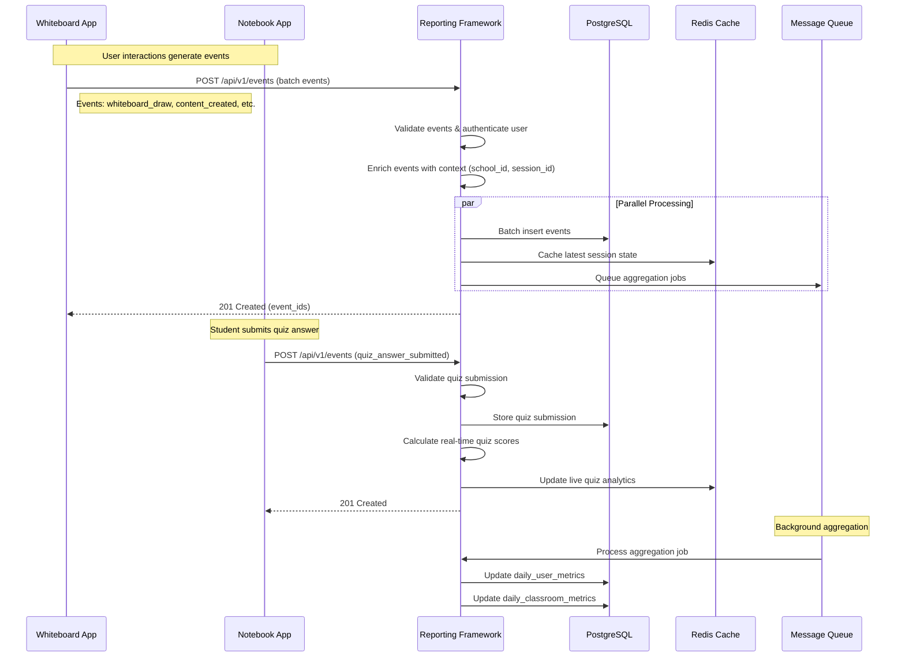
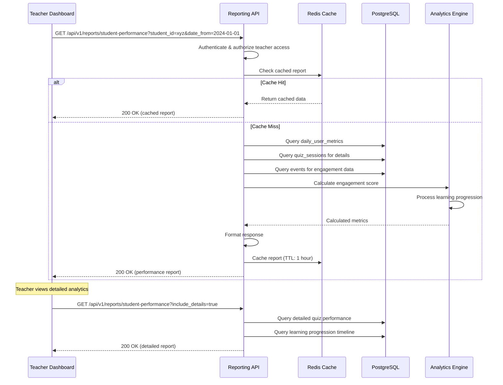
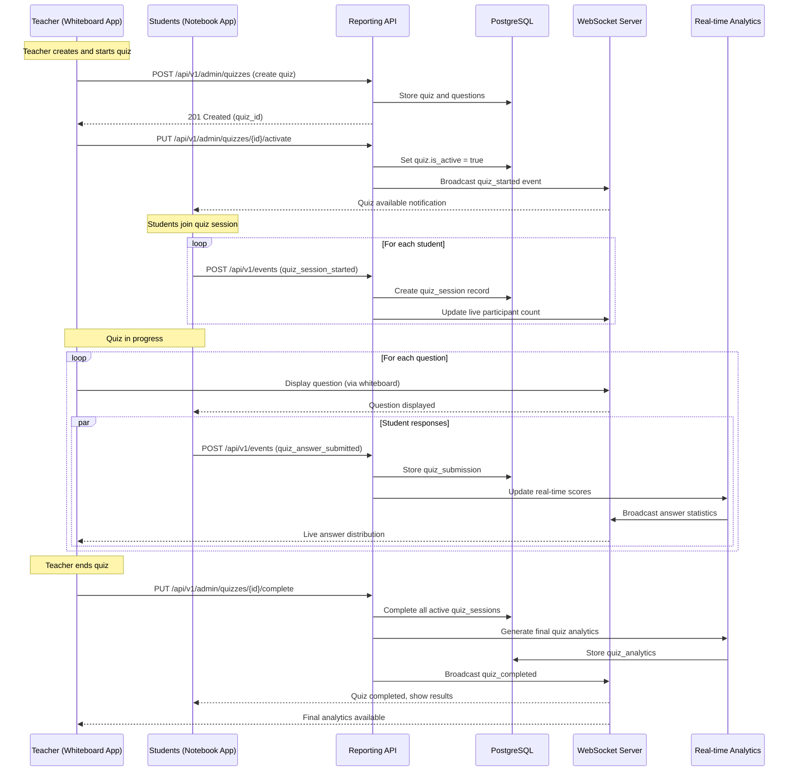
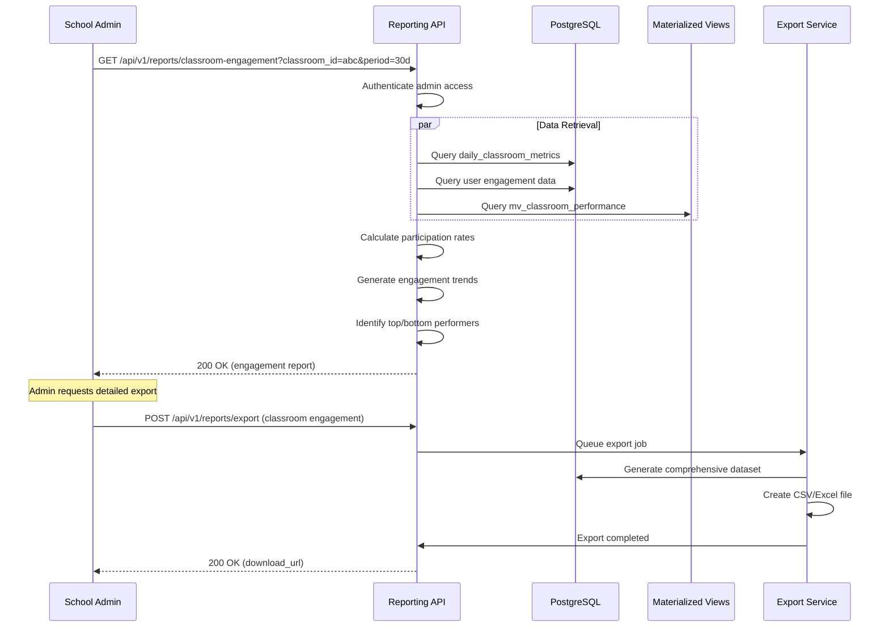
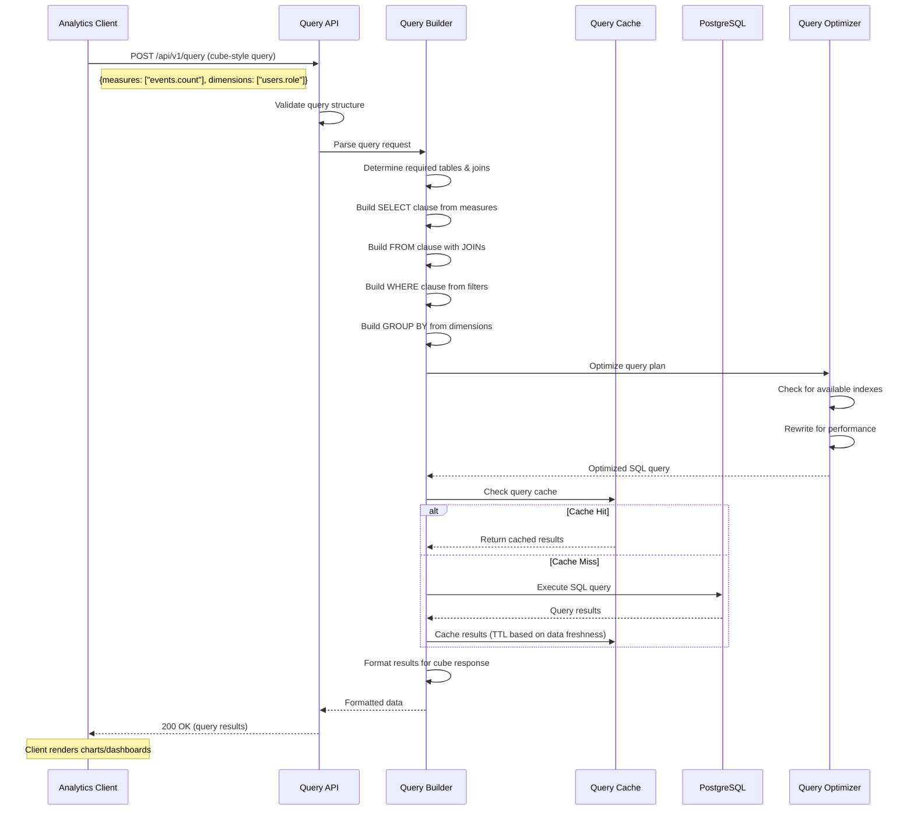
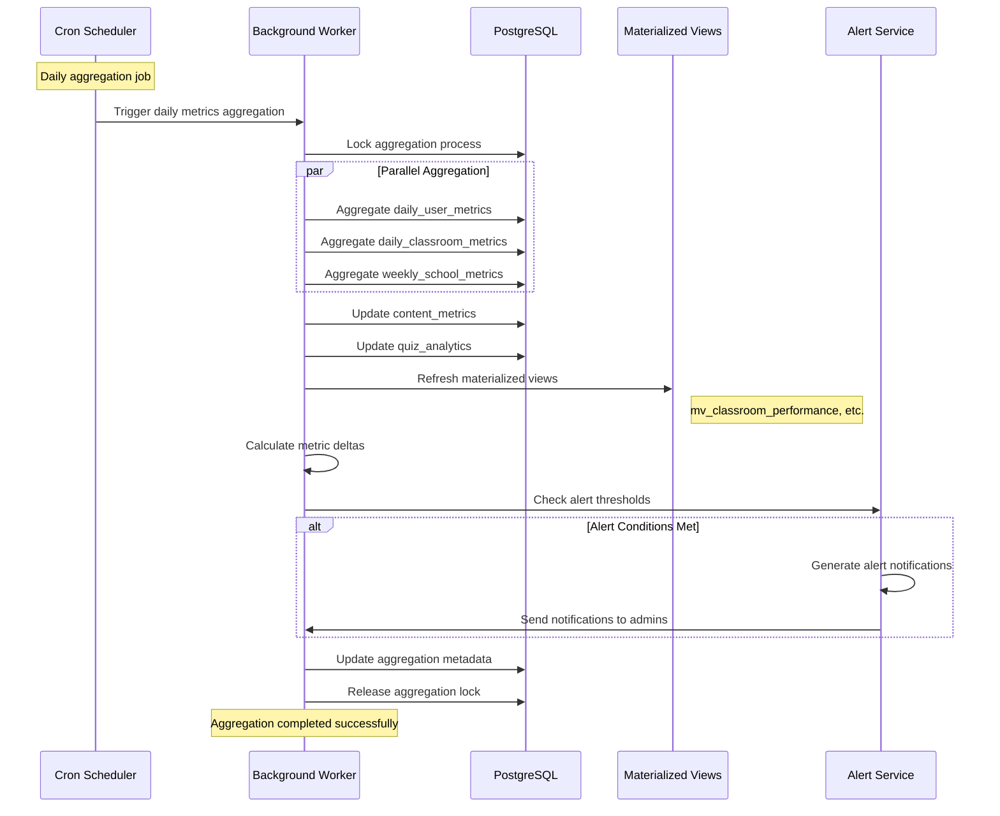
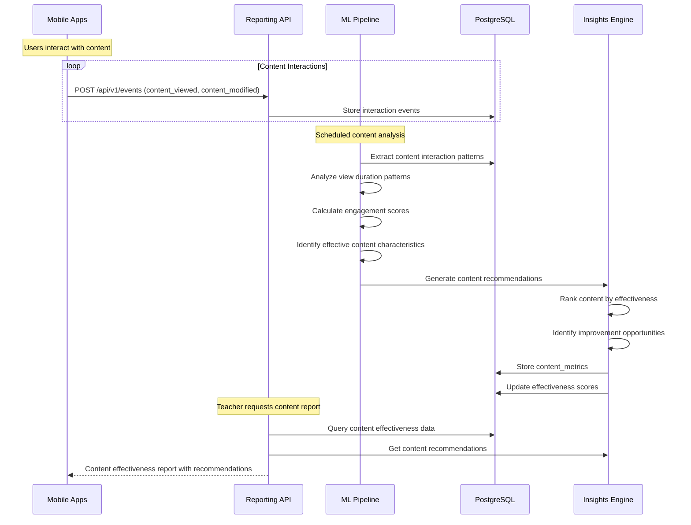

# Educational Reporting Framework - Sequence Diagrams

## 1. Real-time Event Ingestion Workflow

## 2. Student Performance Report Generation

## 3. Real-time Quiz Session Workflow

## 4. Classroom Engagement Analytics Workflow

## 5. Generic Query Processing (Cube.dev style)

## 6. Data Aggregation and Metrics Update Workflow

## 7. Content Effectiveness Analysis Workflow

These sequence diagrams illustrate the key workflows in the educational reporting framework, showing how different components interact to provide real-time analytics, comprehensive reporting, and actionable insights for educational applications.